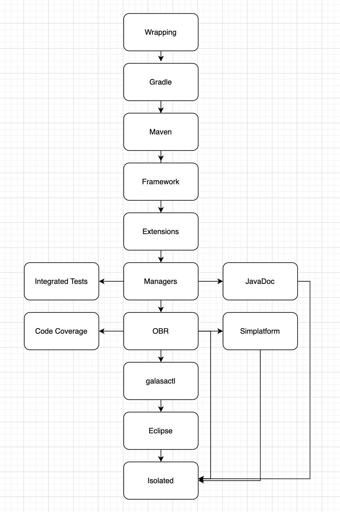

# Galasa Automation Repository

This repository is the single location for all the automation and CI/CD that occurs in Galasa. 

Find out more about:
1. [build-images](#build-images): Custom images required for the build process
1. [dockerfiles](#dockerfiles): The organised Dockerfiles for all the images built for Galasa
1. [docs](#docs): Documentation pages and images
1. [infrastructure](#infrastructure): The Galasa infrastructure as code, including the Kubernetes set-up
1. [offline-tools](#offline-tools): Source code for the copyright checker tool
1. [pipelines](#pipelines): The CustomResourceDefinitions used in our Tekton build pipelines, ClusterRoles, EventListeners, Pipelines, Roles, ServiceAccounts and Tasks
1. [releasePipeline](#release-pipeline): Scripts, instructions and CustomResourceDefinitions for a Galasa release


# Build-images

This directory holds the Go code for custom build images.

## github-status:

This image provides the status of a pull request build - whether it passed or failed - and updates the pull request on GitHub with this status.

## github-verify:

This image is used to verify that a user who opens a pull request into a repository, is an approved code-committer or code-admin, before proceeding with a build.

## github-webhook-monitor:

This image is used to monitor the galasa-dev organisation-wide webhook for any new deliveries, every 2 minutes. It will then trigger the appropriate EventListener for each delivery to then trigger the corresponding build pipeline.

## github-webhook-receiver: 

This image is used to receive requests from the webhook and responds with a 200 response to avoid the appearance of unsuccessful deliveries.


# Dockerfiles

This directory is the single location for all Dockerfiles needed to build the images Galasa needs.

| Category | Dockerfiles |
|----------|-------------|
| Custom images (If there is not be a Docker official image that allows us to use a tool, we have created custom images to enable this. The Dockerfiles for all of the custom images are in the _dockerfiles/common_ directory) | argocd, ghstatus, ghverify, gitcli, github-monitor, github-receiver, gpg, kubectl, openapi, openjdk17-ibm-gradle, swagger, tkn | 
| Go programs | ghstatus, ghverify, github-webhook-monitor, github-webhook-receiver |
| Base image (Most other images are built on top of this. Used to enable use of the Apache HTTP Server) | base |
| Maven repositories for the built Galasa core components | wrapping, gradle, maven, framework, extensions, managers, obr, cli-binary, isolated |
| Maven repositories for other components | galasabld-binary, javadoc-maven-repo |
| Galasa runtime images | obrGeneric, bootEmbedded, ibmBootEmbedded | 
| Galasa CLI | cli, cli-ibm |
| Galasa Isolated build | isolatedZip |
| Galasa Integrated tests | inttests |
| Galasa build utilities | galasabld, galasabld-ibm, galasabld-obr | 
| Galasa Javadoc and REST API doc | javadoc-maven-repo, javadoc-site, restapidoc-site |
| Galasa Simplatform | simplatform, simplatform-amd64, webapp |
| Galasa Resources site | resources |


# Docs

This directory contains images for the documentation and instructions for:
* How to contribute to the project
* How to authenticate a Pull Request to build


# Infrastructure

Galasa's infrastructure is currently spread across two Kubernetes clusters - an internal cluster and an external cluster. 

cicsk8s:
* All Tekton build pipelines are run on the internal cluster.
* The ArgoCD instance which controls all resources for the pipelines (Pipelines, Tasks, etc) is hosted on the internal cluster.

galasa-plan-b-lon02: 
* All Deployments, Services and Ingresses which make up our Maven artifact repositories are hosted on the external cluster.
* The [ArgoCD](argocd.galasa.dev) instance which controls the above resources is hosted on the external cluster.
* Our image registry [Harbor](harbor.galasa.dev) is hosted on the external cluster.


# Offline Tools

The offline-tools directory contains the source code for the GitHub Copyright Checker tool. Read more [here](./offline-tools/copyrighter/README.md)


# Pipelines

## Cluster Roles

A ClusterRole recycle-ecosystem has been created to recycle the Deployments in the galasa-prod ecosystem.

## Event Listeners

A webhook is set up for the galasa-dev organisation on GitHub. Every 2-minutes, the github-monitor checks for new events delivered to the webhook and triggers one of the three EventListeners where necessary.

_Currently, payload validation has been turned off with an annotation in the metadata for these EventListeners. This is because the github-monitor currently cannot validate the payloads from GitHub. This will be turned on in the future once the github-monitor can validate payloads from GitHub._

### github-pr-builder-listener

This EventListener is triggered via webhook when a pull request is opened in a repository.

If a pull request is opened by someone who is not part of an approved group (code admins or code committers), building of the PR will be blocked, until a code admin has commented on the PR 'Approved for building'. Otherwise, this will trigger a PR build.

### github-pr-review-builder-listener

This EventListener is triggered via webhook when a code-admin submits the 'Approved for building' comment on a pull request that was blocked from building. This will then trigger a PR build.

### github-main-builder-listener

This EventListener is triggered via webhook when code is pushed into the main branch of a repository, and triggers a main build of that repository.


## Pipelines

Galasa's architecture means that the core components are built on top of each other, using artifacts from the previous components. The diagram below shows the links between components, starting from Wrapping. In some instances, the build pipeline for a component triggers the next pipeline in the chain, and in some instances, the component is not connected in the chain, but when it is rebuilt, it draws on artifacts from the other.

In the pipelines, you will see that during some of the Maven or Gradle builds, the Maven source is pointed at the Maven artifact repository of the previous component. So, Framework's Gradle build has the build argument _-PsourceMaven=https://development.galasa.dev/main/maven-repo/maven_ so it can use artifacts from Maven's build.

You will also notice that the Dockerfiles for some components are FROM the previous component.



_For more information about the Tasks used in the Pipelines, see the **Tasks** section of this README._

### PR builds (_pr-REPO-NAME_)

PR builds are triggered when a pull request has been opened in one of Galasa's GitHub repositories. The build is done to check that all of the source code submitted in that PR compiles, builds, and that the unit tests pass. 

To ensure that code from an unknown source is not built, PR builds start by verifying if the author of the PR is in an approved group. If they are, the pipeline will proceed, but, if not, the pipeline will stop and an approved user will need to approve the PR for building.

A docker image of the component is also built and pushed to [harbor](harbor.galasa.dev), and the image is tagged with the latest commit sha in the PR.

Finally, the pipeline returns the status of the build, Success, Failure or Error, to the pull request on GitHub.

### Main builds (_branch-REPO-NAME_)

Main builds are triggered when code has been merged or pushed into the main branch on one of Galasa's GitHub repositories. The build checks that the source code compiles, builds, and that the unit tests pass. It also builds a docker image of the repository and pushes it to harbor, this time with the tag "main".

Any deployments that host images built as part of this pipeline are also recycled so that the changes are reflected.

Each Main build also triggers the Main build of the next component in the chain.

As well as being triggered from pushes/merges into main, a Main build can occur when a full Branch build of Galasa is started. _More information on this to come._

### Branch builds (_branch-REPO-NAME_)

Branch builds are triggered manually to build a branch's version of Galasa code and the corresponding images tagged with the branch name, such as galasa-obr:_{BRANCHNAME}_. These images can then be used to deploy a branch's version of the Maven artifact repositories, such as development.galasa.dev/_{BRANCHNAME}_/maven-repo/obr. 

Branch builds do exactly the same thing as Main builds, just for other branches. This is useful as you may want to conduct regression testing against your branch before you merge your changes into the main branch, and you must provide Galasa's regression tests with an OBR Maven repository like the endpoint above, so will need to build your branch and create the Deployments for an OBR repo.

To build changes across multiple GitHub repositories at the same time, the changes must be on the same branch.

**How to do a branch build:**

This example is for a branch build for branch iss001 that contains changes to Framework and Managers (Framework is the first pipeline).

1. Before starting a branch build, you must set up an app on [ArgoCD](argocd.galasa.dev) to control your Deployments.

2. As Framework is the first pipeline in the chain that has changes to be built, you must set up Deployments for Framework and all other repos that come after it, so Framework, Extensions, Managers and OBR. You do this by overriding the values from values.yaml to _REPO_.deploy = true, _REPO_.branch = _BRANCH_ and _REPO_.imageTag = _BRANCH_.

3. The app and all of its resources will show as 'Unhealthy' at first, as the Docker images tagged with your branch name do not exist yet, as they have not been built.
4. Manually start the first pipeline by executing a tkn command, passing in parameters. This command must be ran inside the automation directory, as it references the podTemplate and volumeClaimTemplate for the workspace. If you don't want to run this command inside the automation directory, change the paths to the templates. For our example, running inside the automation directory this would be the command:
```
tkn pipeline start branch-framework -n galasa-build \
--prefix-name trigger-framework-branch \
--workspace name=git-workspace,volumeClaimTemplateFile=pipelines/templates/git-workspace-template.yaml \
--pod-template pipelines/templates/pod-template.yaml --serviceaccount galasa-build-bot \ 
--param fromBranch=main \
--param toBranch=iss001 \
--param revision=iss001 \
--param refspec=refs/heads/iss001:refs/heads/iss001 \
--param imageTag=iss001 \
--param appname=iss001-maven-repo \ 
--param jacocoEnabled=false \ 
--param isMainOrRelease=false
```
5. The first pipeline should start, and then will trigger the following pipeline in the chain by running a similar tkn command in a task at the end of the pipeline.
6. After the OBR pipeline has successfully ran, go to your app on Argo CD and 'Sync' your resources.
7. Your branch build is complete.
8. Remember to delete your app from Argo CD and clear up your branch's images when you are done with your branch.


**Automation**

These pipelines build all of the images used for Galasa's build pipelines, which are stored in the [Automation repository](https://github.com/galasa-dev/automation).

pr-automation:
The pipeline first verifies that the author of the PR to the repository is either an approved code-committer or code-admin, before attempting to build any code. The pipeline then clones the Automation repository at the PR's branch, then gets the commit sha of the latest commit in the PR. The pipeline then builds the Go source code of the custom build images stored in the repository. The pipeline then reports the status of all of the builds back to the PR.

branch-automation:
The pipeline first clones the main branch of the repository then gets the commit sha of the latest commit in the main branch. The pipeline then builds the Go source code of the custom build images stored in the repository. 

Docker images built by these pipelines are pushed [here](https://harbor.galasa.dev/harbor/projects/5/repositories).


**Buildutils**

These pipelines build the binaries for the galasabld CLI tool, the code for which is in the [Buildutils repository](https://github.com/galasa-dev/buildutils).

pr-buildutils:
The pipeline first verifies that the author of the PR to the repository is either an approved code-committer or code-admin, before attempting to build any code. The pipeline then clones both the Automation repository at the main branch and Buildutils repository at the PR's branch, then gets the commit sha of the latest commit in the Buildutils PR. The pipeline then executes the Buildutils' Makefile, then builds two binary images to run galasabld and an image to host the binaries in a Maven repository. The pipeline then reports the status of all of the builds back to the PR.

branch-buildutils:
The pipeline first clones both the Automation and Buildutils repositories at the main branch. The pipeline then executes the Buildutils' Makefile, then builds two binary images to run galasabld and an image to host the binaries in a Maven repository. The Maven repository that publishes the binaries is then recycled, and a snapshot-main-to-prod pipeline is triggered.

The Docker image for the galasabld CLI is pushed [here](https://harbor.galasa.dev/harbor/projects/3/repositories/galasabld/artifacts-tab).


**CLI**

These pipelines build the binaries for the galasactl CLI tool, the code for which is in the [CLI repository](https://github.com/galasa-dev/cli).

pr-cli:
The pipeline first verifies that the author of the PR to the repository is either an approved code-committer or code-admin, before attempting to build any code. The pipeline then clones the Automation and Framework repositories at the main branch, and then CLI repository at the PR's branch. The pipeline then uses Gradle to gather needed dependencies, which include the openapi.yaml artifact.. Go client code is then generated from the openapi.yaml file in Framework so that the CLI can talk to the API server. The pipeline then clears the go.mod and go.sum as they are out of date, sets the Galasa version this build is part of, gets the commit SHA of the latest commit in the PR. The make command is then invoked to build the Go code, run unit tests and run code coverage. Finally, the CLI Docker images are built and the status of the pipleine is returned to the PR. 

branch-cli:
The pipeline clones the Automation, Framework and CLI repositories at the main branch. The pipeline follows the same steps as pr-cli, apart from returning the status of the pipeline to a PR as this is for a main build. This pipeline however recycles the Maven repositories which publish the CLI binaries, and then triggers a snapshot-main-to-prod pipeline. 

The Docker image for the galasactl CLI is pushed [here](https://harbor.galasa.dev/harbor/projects/3/repositories/galasa-cli-amd64/artifacts-tab).

The Docker image conatining the galasactl CLI binaries is pushed [here](https://harbor.galasa.dev/harbor/projects/3/repositories/galasa-cli-binary-downloadables/artifacts-tab).

The CLI binaries are downloadable from [here](https://development.galasa.dev/main/binary/cli).


**Extensions**

These pipelines build the [Galasa Extensions](https://github.com/galasa-dev/extensions).

pr-extensions:
The pipeline first verifies that the author of the PR to the repository is either an approved code-committer or code-admin, before attempting to build any code. The pipeline then clones the Automation repository at the main branch and the Extensions repository at the PR's branch. It gets the commit sha of the latest commit in the PR. It then runs a Gradle build of the repository. A Docker image is then built to host the artefacts in a Maven repository. The pipeline then reports on the status of the builds back to the PR.

branch-extensions:
The pipeline first clones the Automation and Extensions repositories at the main branch. It then follows the same steps as pr-extensions other than reporting back to a PR. The pipeline then recycles the deployment to host the Maven repository and the branch-managers pipeline is then triggered using the Tekton CLI.

The Docker image for the Extensions Maven repo is [here](https://harbor.galasa.dev/harbor/projects/3/repositories/galasa-extensions/artifacts-tab).

The Extensions Maven repository is [here](https://development.galasa.dev/main/maven-repo/extensions).


**Framework**

These pipelines build the [Galasa Framework](https://github.com/galasa-dev/framework)

pr-framework:
The pipeline first verifies that the author of the PR to the repository is either an approved code-committer or code-admin, before attempting to build any code. The pipeline then clones the Automation repository at the main branch and the Framework repository at the PR's branch. It gets the commit sha of the latest commit in the PR. It then runs a Gradle build of the repository. A Docker image is then built to host the artefacts in a Maven repository. The pipeline then reports on the status of the builds back to the PR.

branch-framework:
The pipeline first clones the Automation and Framework repositories at the main branch. It then follows the same steps as pr-framework other than reporting back to a PR. The pipeline then recycles the deployment to host the Maven repository. The branch-extensions pipeline is then triggered using the Tekton CLI.

The Docker image for the Framework Maven repo is [here](https://harbor.galasa.dev/harbor/projects/3/repositories/galasa-framework/artifacts-tab).

The Framework Maven repository is [here](https://development.galasa.dev/main/maven-repo/framework).


**Galasa UI**

_More documentation to be written._ 


**GitHub copyright**

_More documentation to be written._ 


**Gradle**

These pipelines build the [Galasa Gradle plug-in](https://github.com/galasa-dev/gradle)

pr-gradle:
The pipeline first verifies that the author of the PR to the repository is either an approved code-committer or code-admin, before attempting to build any code. The pipeline then clones the Automation repository at the main branch and the Gradle repository at the PR's branch. It gets the commit sha of the latest commit in the PR. It then runs a Gradle build of the repository. A Docker image is then built to host the artefacts in a Maven repository. The pipeline then reports on the status of the builds back to the PR.

branch-gradle:
The pipeline first clones the Automation and Gradle repositories at the main branch. It then follows the same steps as pr-gradle other than reporting back to a PR. The pipeline then recycles the deployment to host the Maven repository. The branch-maven pipeline is then triggered using the Tekton CLI.

The Docker image for the Gradle Maven repo is [here](https://harbor.galasa.dev/harbor/projects/3/repositories/galasa-gradle/artifacts-tab).

The Gradle Maven repository is [here](https://development.galasa.dev/main/maven-repo/gradle).


**Helm**

These pipelines test the [Helm chart](https://github.com/galasa-dev/helm) to install a Galasa ecosystem.

pr-helm:
The pipeline first verifies that the author of the PR to the repository is either an approved code-committer or code-admin. It then attempts to install an ecosystem using the Helm chart by creating an ArgoCD app, syncs the app and waits for confirmation of app health. It then cleans up the app if successful and returns the status of the pipeline to the PR.

branch-helm:
This pipeline follows the same steps as pr-helm but for the main branch.


**Integrated tests**

These pipelines build the [Galasa Integrated tests](https://github.com/galasa-dev/integratedtests)

pr-integratedtests:
The pipeline first verifies that the author of the PR to the repository is either an approved code-committer or code-admin, before attempting to build any code. The pipeline then clones the Automation repository at the main branch and the Integratedtests repository at the PR's branch. It gets the commit sha of the latest commit in the PR. It then runs both a Gradle build and a Maven build of the repository. A Docker image is then built to host the artefacts in a Maven repository. The pipeline then reports on the status of the builds back to the PR.

branch-integratedtests:
The pipeline first clones the Automation and Integratedtests repositories at the main branch. It then follows the same steps as pr-integratedtests other than reporting back to a PR. The pipeline then recycles the deployment to host the Maven repository.

The Docker image for the Integrated tests Maven repo is [here](https://harbor.galasa.dev/harbor/projects/3/repositories/galasa-inttests/artifacts-tab).

The Integrated tests Maven repository is [here](https://development.galasa.dev/main/maven-repo/inttests).


**Isolated**

These pipelines build the isolated and mvp images which are used to install Galasa offline. [Galasa Isolated](https://github.com/galasa-dev/isolated) 

pr-isolated:
The pipeline first verifies that the author of the PR to the repository is either an approved code-committer or code-admin, before attempting to build any code. It then clones the Automation, Framework, Extensions, Managers and OBR repositories at the main branch and the Isolated repository at the PR's branch.

galasabld is used to generate a pom template for the Isolated distribution of Galasa and then several different Maven builds are done to build the different dependencies, Javadoc and jars that the Isolated packages. The same is then done for the MVP distribution. 
As the Docker images for this are so large, these are pushed to ICR instead of Harbor.

The status of the pipeline is then returned to the PR.

branch-isolated:
This pipeline follows the same steps as pr-isolated, apart from checking the author of the PR and reporting back to the PR. It also recycles the Maven repositories which host the deployed artefacts.

The Docker image for the isolated build is [here](https://harbor.galasa.dev/harbor/projects/3/repositories/galasa-isolated/artifacts-tab).

The Docker image for isolated.tar is [here](https://harbor.galasa.dev/harbor/projects/3/repositories/galasa-distribution/artifacts-tab). This image may be used if you want to host Galasa on an internal server to be accessed by other users. 

The isolated zip file can be downloaded from [here](https://development.galasa.dev/main/maven-repo/isolated). It can then be extracted. The Docker image for this is [here](https://harbor.galasa.dev/harbor/projects/3/repositories/galasa-isolated-zip/artifacts-tab).

The Docker image for the mvp build is [here](https://harbor.galasa.dev/harbor/projects/3/repositories/galasa-mvp/artifacts-tab). The mvp is similar to isolated but contains only the most used and most stable managers and tests.

The mvp zip file can be downloaded from [here](https://development.galasa.dev/main/maven-repo/mvp). It can then be extracted. The Docker image for this is [here](https://harbor.galasa.dev/harbor/projects/3/repositories/galasa-mvp-zip/artifacts-tab).


**Managers**

These pipelines build the [Galasa Managers](https://github.com/galasa-dev/managers)

pr-managers:
The pipeline first verifies that the author of the PR to the repository is either an approved code-committer or code-admin, before attempting to build any code. The pipeline then clones the Automation repository at the main branch and the Managers repository at the PR's branch. It gets the commit sha of the latest commit in the PR. It then runs a Gradle build of the repository. A Docker image is then built to host the artefacts in a Maven repository. The pipeline then reports on the status of the builds back to the PR.

branch-managers:
The pipeline first clones the Automation and Managers repositories at the main branch. It then follows the same steps as pr-managers other than reporting back to a PR. The pipeline then recycles the deployment to host the Maven repository. The branch-obr pipeline is then triggered using the Tekton CLI.

The Docker image for the Managers Maven repo is [here](https://harbor.galasa.dev/harbor/projects/3/repositories/galasa-managers/artifacts-tab).

The Managers Maven repository is [here](https://development.galasa.dev/main/maven-repo/managers).


**Maven**

These pipelines build the [Galasa Maven plug-in](https://github.com/galasa-dev/maven)

pr-maven:
The pipeline first verifies that the author of the PR to the repository is either an approved code-committer or code-admin, before attempting to build any code. The pipeline then clones the Automation repository at the main branch and the Maven repository at the PR's branch. It gets the commit sha of the latest commit in the PR. It then sets up the GPG key for Maven to use, then runs a Maven build of the repository. A Docker image is then built to host the artefacts in a Maven repository. The pipeline then reports on the status of the builds back to the PR.

branch-maven:
The pipeline first clones the Automation and Maven repositories at the main branch. It then follows the same steps as pr-maven other than reporting back to a PR. The pipeline then recycles the deployment to host the Maven repository. The branch-framework pipeline is then triggered using the Tekton CLI.

The Docker image for the Maven Maven repo is [here](https://harbor.galasa.dev/harbor/projects/3/repositories/galasa-maven/artifacts-tab).

The Maven Maven repository is [here](https://development.galasa.dev/main/maven-repo/maven).


**OBR**

These pipelines build the Galasa OSGi Bundle Repository (OBR) and the Javadoc for Galasa. Both are stored in the [OBR repository](https://github.com/galasa-dev/obr).

The Javadoc is deployed to a Maven repository as a zip file, and also a Javadoc site.

pr-obr:
The pipeline first verifies that the author of the PR to the repository is either an approved code-committer or code-admin, before attempting to build any code. It then clones the Automation, Framework, Extensions and Managers repositories at the main branch, and the OBR repository at the PR's branch. It gets the commit sha of the latest commit in the PR, then sets up the GPG key for Maven to use. galasabld is used to generate a pom for the BOM of Galasa and this is then built with Maven. galasabld generates a template for the OBR pom and this is also built. A Docker image for the OBR is then built.

galasabld is used to generate a template for the Javadoc pom and this is built with Maven. A Docker image for the artefacts and the Javadoc site is built. Finally the status of the pipeline is returned to the PR.

branch-obr:
This pipeline follows the same steps as pr-obr apart from verifying the author of or reporting back to a PR. It also recycles the deployments for the OBR Maven repository, Javadoc Maven repository and the Javadoc site. It finally triggers the branch-obr-generic pipeline. 

The Docker image for the OBR Maven repo is [here](https://harbor.galasa.dev/harbor/projects/3/repositories/galasa-obr/artifacts-tab).

The OBR Maven repository is [here](https://development.galasa.dev/main/maven-repo/obr).


**OBR Generic**

These pipelines build a generic Galasa OSGi Bundle Repository (OBR) and place it inside the bootEmbedded and ibmBootEmbedded images, which are used for running Galasa tests.

pr-obr-generic:
The pipeline first verifies that the author of the PR to the repository is either an approved code-committer or code-admin, before attempting to build any code. It then clones the Automation, Framework, Extensions and Managers repositories at the main branch, and the OBR repository at the PR's branch. galasabld generates a pom for OBR generic and it is built with Maven, then a Docker image built. Property files are then copied to build the the runtimes of Galasa. The status of the pipeline is then returned to the PR. 

branch-obr-generic:
This pipeline follows the same steps as the pr-obr-generic pipeline other than verifying the author of or returning status back to a PR. It then triggers either the branch-helm and run-tests pipelines if doing a Main build, or branch-cli if doing a Complete build.


**Simplatform**

These pipelines build the Galasa Simbank applications (_to-do_) and and set of sample Simbank tests, all stored in the [Simplatform repository](https://github.com/galasa-dev/simplatform).

pr-simplatform:
The pipeline first verifies that the author of the PR to the repository is either an approved code-committer or code-admin, before attempting to build any code. The Automation repository is cloned at the main branch and the Simplatform repository at the PR's branch. It gets the commit sha of the latest commit in the PR, then sets up the GPG key for Maven to use. Maven builds the Simplatform application and then the Simbank tests. Docker builds the Simplatform artefacts and then an executable Jar for the Simplatform app. The status of the pipeline is then returned to the PR.  

branch-simplatform:
This pipeline follows the same steps as pr-simplatform apart from verifying a PR's author or returning status to a PR. In addition, it recycles the deployment for the Simplatform Maven repository and then triggers a snapshot pipeline.

The Docker image for the Simplatform Maven repo is [here](https://harbor.galasa.dev/harbor/projects/3/repositories/galasa-simplatform/artifacts-tab) and the image for the Simplatform AMD64 jar is [here](https://harbor.galasa.dev/harbor/projects/3/repositories/galasa-simplatform-amd64/artifacts-tab).

The Simplatform Maven repository is [here](https://development.galasa.dev/main/maven-repo/simplatform).


**Wrapping**

These pipelines build the [Wrapping repository](https://github.com/galasa-dev/wrapping). This repository wraps external Galasa dependencies that are not in an OSGi bundle into an OSGi bundle so it can be ran in Galasa.

pr-wrapping:
The pipeline first verifies that the author of the PR to the repository is either an approved code-committer or code-admin, before attempting to build any code. The pipeline then clones the Automation repository at the main branch and the Wrapping repository at the PR's branch. It gets the commit sha of the latest commit in the PR. It then sets up the GPG key for Maven to use, then runs a Maven build of the repository. A Docker image is then built to host the artefacts in a Maven repository. The pipeline then reports on the status of the builds back to the PR.

branch-wrapping:
The pipeline first clones the Automation and Wrapping repositories at the main branch. It then follows the same steps as pr-maven other than reporting back to a PR. The pipeline then recycles the deployment to host the Maven repository. The branch-gradle pipeline is then triggered using the Tekton CLI.

The Docker image for the Wrapping Maven repo is [here](https://harbor.galasa.dev/harbor/projects/3/repositories/galasa-wrapping/artifacts-tab).

The Wrapping Maven repository is [here](https://development.galasa.dev/main/maven-repo/wrapping).


**Miscellaneous**

codecoverage: 
This pipeline generates and deploys a [code coverage report](https://development.galasa.dev/codecoverage) for Galasa based on data from Jacoco.

integration-to-prod:
This pipeline snapshots the integration images and promotes them to prod. 

recycle-ecosystem:
This pipeline recycles deployments in the galasa-prod ecosystem: api, testcatalog, engine-controller, resource-monitor and metrics. This is triggered after code is promoted to production so that the ecosystem has the latest Galasa code.

run-tests:
This pipeline uses galasactl to run a test in the ecosystem against the integration images, before promoting integration to prod.

snapshot-integration:
This pipeline snapshots all of the main images and promotes them to integration.


## Roles

A Role to recycle deployments on the cluster.


## Service Accounts

Definitions for the ServiceAccounts used during pipelines.


## Tasks

### argocd-cli

This task uses the Argo CD CLI to interact with resources that are managed by Argo CD, including resources for our Maven repositories. 

Parameters:
* command: An array of each part of the argocd command to execute.
* server: The argocd server to perform the command on.
* authSecretName: The secret name to use to authenticate to the server.
* authSecretKey: The secret key to use to authenticate to the server.

This task uses the custom [argocd-cli image](https://harbor.galasa.dev/harbor/projects/5/repositories/argocd-cli/artifacts-tab). 


### galasabld-command

This task uses the galasabld CLI to perform galasabld commands, such as galasabld template.

Parameters:
* context: The directory to perform the command in.
* command: An array of all of the parts of the command.
* galasabldImageTag: The image tag to use, defaults to main.

This task uses the custom [galasabld image](https://harbor.galasa.dev/harbor/projects/5/repositories/galasabld/artifacts-tab).


### galasactl-command

This task uses the galasactl CLI to perform galasactl commands, such as galasactl runs submit.

Parameters:
* context: The directory to perform the command in.
* command: An array of all of the parts of the command.
* galasactlImageTag: The image tag to use, defaults to main.

This task uses the custom [galasactl image](https://harbor.galasa.dev/harbor/projects/2/repositories/galasa-cli-ibm-amd64/artifacts-tab).


### get-commit

This task gets the latest git commit hash from the provided repository, and stores it in a location in the workspace.

Parameters:
* pipelineRunName: The name of the currently running PipelineRun, from the PipelineRun context, to find the working directory.
* repo: The name of the GitHub repository.

This task uses the custom [gitcli image](https://harbor.galasa.dev/harbor/projects/5/repositories/gitcli/artifacts-tab).


### git-checkout

This task switches to the correct git branch for a branch-level build as the pipeline always clones the main branch.

Parameters:
* context: The directory to perform the command in.
* branch: The name of branch to switch to.

This task uses the custom [gitcli image](https://harbor.galasa.dev/harbor/projects/5/repositories/gitcli/artifacts-tab).


### git-clean

This task cleans a provided subdirectory from the workspace.

Parameters:
* subdirectory: The subdirectory of the workspace to clean.

This task uses the latest [busybox image](https://hub.docker.com/_/busybox).

_All uses of this task have been commented out as the pipelines use a volumeClaimTemplate which is provisioned for each pipeline, so it is not important to clear up after a pipeline. However, if in future a PersistentVolumeClaim is used in the pipelines, git-clean will need to be used so that the storage is kept clean._


### git-clone

This task clones a GitHub repository from the provided URL into the workspace.


### git-status

This task calls the github-status Go program with parameters extracted from the GitHub webhook payload, and sends the status of a PR build pipeline from Tekton to the pull request on GitHub. The status is updated and a comment is posted to the pull request.

Parameters:
* status: The status of the Tasks from the Tekton pipeline. It is only a Success if all Tasks passed.
* prUrl: The URL of the pull request on GitHub.
* statusesUrl: The URL to return the status of the build to the pull request via a POST request.
* issueUrl: The URL to return comments to the pull request via a POST request.
* pipelineRunName: The PipelineRun name triggered by the PR.

This task uses the custom [ghstatus image](https://harbor.galasa.dev/harbor/projects/5/repositories/ghstatus/artifacts-tab).


### git-verify

This task calls the github-verify Go program with parameters extracted from the GitHub webhook payload, to verify if a user who opens a pull request into a repository, is an approved code-committer or code-admin, before proceeding with a build. If the user is an approved user, the PR build proceeds, if not, a comment is posted to the pull request informing the author that the PR needs to be approved for building.

Parameters:
* userId: The user ID of the GitHub user who has opened the pull request.
* prUrl: The URL of the pull request on GitHub.
* action: Describes whether the pull request is opened, closed, synchronized etc.

This task uses the custom [ghverify image](https://harbor.galasa.dev/harbor/projects/5/repositories/ghverify/artifacts-tab).


### go-build

This task is used to build Go code. 

Parameters:
* context: Describes the path to the Go code to build.
* goArgs: Include the Go command to be executed such as build or install, and any other flags and arguments needed.
* The other paramters are all environment variables which have default values and can be overwritten if necessary.

This task uses the latest official [GoLang image](https://hub.docker.com/_/golang).


### gradle-build

This task executes a Gradle build. It is generic and allows for parameters to dictate the exact type of build.

Parameters:
* context: The directory where you want the Gradle build to take place (where the gradle.build file is).
* build-args: An array used to pass any additional arguments to the Gradle build.
* command: An array of commands to use in the build such as 'publish' and 'check'.

This task uses the offical [Gradle image](https://hub.docker.com/_/gradle) from DockerHub.


### kaniko-builder

This task allows you to build and push Docker images within a Kubernetes cluster or container. This is needed as Docker virtualisation cannot be performed inside a containerised environment.

Parameters:
* pipelineRunName: The PipelineRun name to use for the working directory.
* imageName: The name to give the image after it is built, including the tag.
* context: The Docker build context
* noPush: Allows you to choose whether you want to push the image built to the given destination (dockerRegistry/imageName).
* dockerfilePath: The path to the Dockerfile needed for the build.
* buildArgs: An array used to pass any build arguments needed into the Dockerfile.

The task uses [kaniko-executor image](https://console.cloud.google.com/gcr/images/kaniko-project/GLOBAL/executor@sha256:23ae6ccaba2b0f599966dbc5ecf38aa4404f4cd799add224167eaf285696551a/details?tag=latest), from gcr.io (Google Container Registry).


### kubectl 

This task allows you to execute kubectl commands on the cluster the pipeline runs on.

Parameters: 
* command: An array of the parts of the command.

The task uses the [kubectl image](https://harbor.galasa.dev/harbor/projects/3/repositories/kubectl/artifacts-tab).


### make

This task is used to perform the shell command 'make all' to execute a Makefile.

Parameters:
* directory: The directory to perform the command in.
* params: An array of commands, defaults to all.

This task uses the official [GoLang image](https://hub.docker.com/_/golang).


### maven-build

This task performs a Maven build. It is generic and allows for parameters to dictate the exact type of build.

Parameters:
* context: The directory where you want the Maven build to take place (where the pom.xml file is).
* settingsLocation: The location of the settings.xml produced by the maven-gpg task. This will normally be /workspace/git/PIPELINE_RUN_NAME/REPO/gpg/settings.xml. For the OBR builds, as two Maven builds occur in two different contexts, to avoid doing maven-gpg twice, the settingsLocation is set.
* buildArgs: An array used for any additional arguments to pass to Maven.
* command: An array of commands to use in the build such as 'deploy' or 'install'.
* image: The Maven image to use for the task, defaults to Maven version 3.8.6 with the IBM Semeru Java 17.

This task uses the offical [Maven 3.8.6 with the IBM Semeru Java 17 image](https://hub.docker.com/_/maven) from DockerHub unless overridden.


### maven-gpg

The Maven build uses the Maven GPG Plugin to sign all of the built artifacts using GnuPG. This task uses the GnuPG CLI to put the correct secrets in place for the Maven GPG Plugin to use during the maven-build task. This task uses the ExternalSecret mavengpg.

1. The first step makes a new directory within the provided working directory.
1. The second step performs a gpg command to import the passphrase and gpg key.
1. In the last step, the settings.xml from the mavengpg secret that has been populated with the galasa.passphrase is copied and put in the directory made in the first step.

Parameters:
* context: The directory to execute the command in.
* settingsDirectory: The location of the settings.xml to use in the subsequent Maven build, defaults to /workspace/git/gpg if not overriden.

This task uses the custom [gpg image](https://harbor.galasa.dev/harbor/projects/5/repositories/gpg/artifacts-tab). This task also uses the offical [busybox image](https://hub.docker.com/_/busybox) from DockerHub to perform Unix commands.


### script

This task is used to perform a script.

Parameters:
* context: The directory to perform the command in.
* script: A string containing the script to be performed
* image: By default this uses busybox to contain most commands likely needed. However if other commands are needed then a custom image can be passed here.

This task, by default, uses the latest [busybox image](https://hub.docker.com/_/busybox). Unless, an image is passed as a paramter.


### tkn-cli

This task is used the Tekton CLI to communicate with Tekton.

Parameters:
* context: The directory to perform the command in.
* command: An array with the parts of the command to perform.

This task uses the custom [tkn image](https://harbor.galasa.dev/harbor/projects/5/repositories/tkn/artifacts-tab).


## Templates

This directory contains template files for a Pod and Workspace that must be passed into the tkn CLI to kick off a pipeline manually, as described below.


## How to manually trigger a pipeline
Use the `trigger-pipeline.sh` script to trigger one of the main-line build pipelines.
The tool may not support all the pipelines yet, feel free to add ones which are missing.

For example: To kick-off the extensions pipeline...
```
./trigger-pipeline.sh --extensions
```

> Note: The pipelines kicked off are the mainline pipelines, not pull-request pipelines,
so be careful as this will cause things to be published to the public repositories.

This tool is useful if there is a glitch in the 'chain' or builds kicked off when 
something on a `main` branch builds, but fails to kick-off the next build in the 'chain'.
So you can re-start the chain of builds without resorting to submitting empty change-sets
and another pull request. 

ie: If the main builds fail and you want to re-start a build.

This can be the case if we get environmental failures, for examople when argocd fails to 
re-deploy one of the docker images from the build.

## How are the IBM build machines protected from malicious code in a fork-pull-request ?
There are built-in protections to prevent malicious code being executed as part of a build process
on the IBM build hardware. The mechanism is described [here](./docs/pull-request-build-authentication.md).


# Release Pipeline

This directory contains all scripts and pipelines and the specific instructions needed to complete a release of the open source Galasa project. See the [README](./releasePipeline/README.md) for more details.