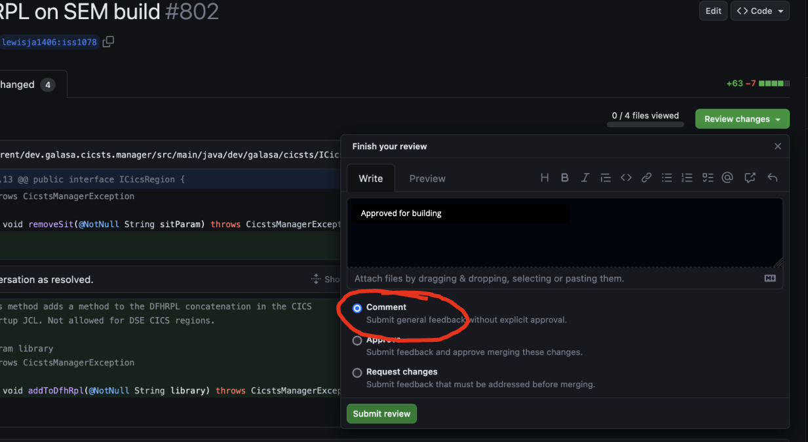

# How to contribute a change to a Galasa Repository

All of the Galasa repositories share a common method of how to contribute.

There are two ways:
- Become an approved committer
- Fork the code and submit a Pull Request.

## Become an approved committer

This means you are trusted with the responsibility for not 
breaking the code, so your ID appears as a member of the `code-committers` team in 
the `galasa-dev github organisation`(https://github.com/galasa-dev). 

With this authority you are able to create a branch on any of the repositories.

Pull requests for any of these branches are approved for building automatically.

If you commit to a branch on a pull request from a fork, your change will also be approved
for building.

## Fork the code and submit a Pull Request

You are not an approved committer on the project, so when you submit a Pull Request
the changes will need to be approved.

Any of the other approved committers will then have to review your changes, and 
check that no malicious code is being added, and that the code passes inspection.
They will then have to add the phrase "Approved for building" in the review submission.

Like this:

This will cause a build of the code to be performed and build checks/tests carried out.

(The Approve or Request changes options can also be used with the same comment).

The comment can contain other things, but if it is going to be built, it must contain the 
"Approved for building" phrase somewhere.

If the code in the Pull Request is updated, you will need to go through the procedure again
in order to get approval for another build attempt, and so on.

Once built, a trusted committer may merge the change into the codebase once the build checks
are complete, and all discussions have been resolved.
