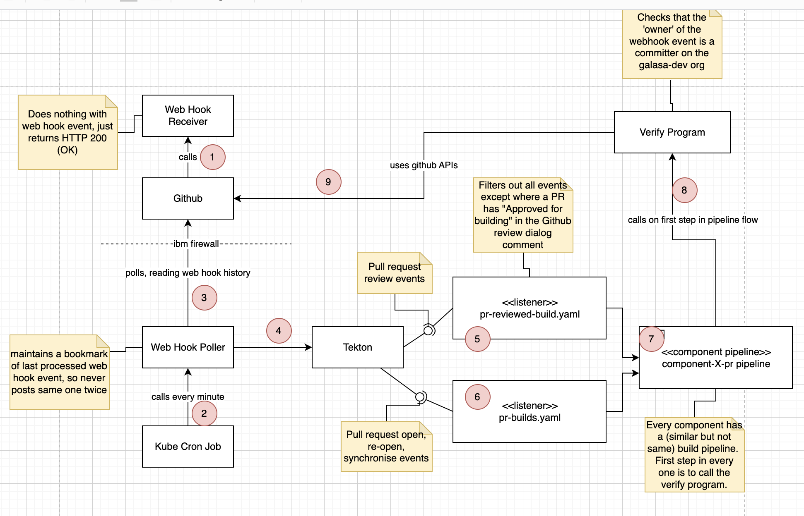

# Pull request authentication mechanism

Github branches containing Galasa code get built on IBM hardware within the IBM filewall.
Only trusted project committers can create branches with pull requests.

People who are not trusted create forks and pull requests, which are subject to the limitation
that such code submitted via this route requires a trusted committer to review the code before
it will run inside the IBM firewall, on a tekton build system. If we didn't do that, then anyone
could submit any code to a build within the IBM firewall, nefarious or benign.

How does this work to stop unwanted changes being permitted to build and use the IBM machines ? 
Well, there are several moving parts. Lets go through some typical flows.

The above diagram shows the components several of the solution that is currently used to shield IBM
build systems from malicious changes.

## Flow of when a PR is raised with fork by a non-trusted developer

Lets assume a non-trusted developer takes a fork of the CLI project, makes a change and raises
a PR back to the origin CLI project repository.

1. When they open the PR, github will call a Web Hook Receiver program. It doesn't do anything with the web hook event, merely returning HTTP 200 (OK), so that Github thinks it delivered the webhook event.
2. At some point in time after that happened, a cron job in Kubernetes will fire (every minute).
It calls a [web hook monitor](../build-images/github-webhook-monitor) program.
3. The web hook monitor calls out to Github, through the IBM firewall, and interrogates Github for information about 
recent web hook events it has sent out for the galasa-dev organisation.
For each webhook event it finds in the Github events history, it sends the exact webhook payload to Tekton.
When there are no more events to process in Github, the monitor saves a 'bookmark' of the latest event it has processed 
and exits.
When the monitor next wakes up, it reads the bookmark, and knows where to start 'replaying' the github events from, thereby avoiding issuing duplicate hook event copies to Tekton.
4. The event indicating the PR was opened is sent to Tekton. The user id in the event is the id of the non-trusted developer.
6. The `pr-builds` Tekton listener fires, and processes the 'PR open' event. The user id in the event is the id of the non-trusted developer still. 
7. The listener kicks-off a component build on the CLI pr pipeline.
8. The first step in the CLI pipeline is to vall the [verify program](../build-images/github-verify/), passing the userid from the event. ie: The non-trusted developer user id.
9. The verify program calls into Github, to find the 'committers' team in the 'galasa-dev' organisation. It queries all the members of that team, and checks to see if the user-id being checked is in that team of trusted developers. In this case the non-trusted developer is not in the list, so the step in the CLI pipeline fails, and the PR code is never cloned or built. The verify program then adds a comment to the pull request "Approval from a committer needed" (or similar).

If the developer were in the list, the CLI component would have been built.

## Flow when a PR approved by a trusted developer, with 'Approved for building' text in the review comment

Lets now assume that the non-trusted developer contacted a trusted developer on the Galasa project, and asked for a code 
review.

The trusted developer might find the code change to look good, with no bad or harmful code in at all. They then...
1. Use the Github code review feature to mark the pull request as Approved, or Not approved pending changes, or just comment on their review using the submit review dialog. Lets assume they typed "Approved for building".
2. The review event webhook goes to the web hook received (which does nothing but return HTTP 200).
3. The Cron job fires and kicks off the web hook monitor.
4. The web hook monitor interrogates Github and finds a review event which is then posted to Tekton. The user id of this event is the trusted developer.
5. The `pr-reviewed-build` listener is launched, which checks that the phrase "Approved for building" is in the review comment. 
7. The CLI component pr-pipeline is invoked. The first step in the pipeline invokes the verify program. The user id passed to the pipeline is the userid from the PR review submission. ie: The trusted developer.
8. The verify program then determines that the userid is trusted, and allows the CLI pipeline to continue building.

In this way, the approval of the PR, or merely the commenting in an approval submission dialog with the text "Approved for building" inside, caused the code from the un-trusted developer to be built.

Were the un-trusted developer to submit more changes, they would also require a similar approval for the build process to 
run.

## Conclusion

As we have shown above, forks can be used to contribute to the Galasa project, but only with the approval of 
a trusted developer with committer privileges.

